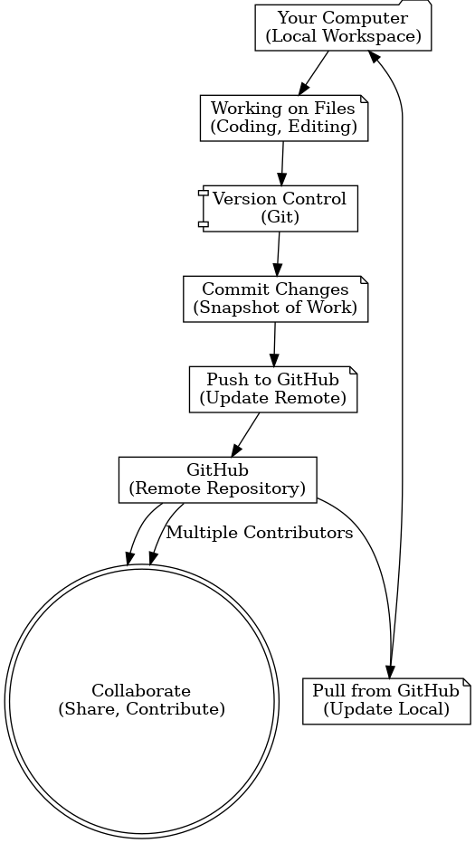

# README

#TODO: 
- [ ] **Add a description of project**


<details>
<summary>Github notes</summary>


### Github docs
[Github Docs docs](https://docs.github.com/en/get-started)



## Git Commands
### How to stage, commit and push changes to github

```bash
git status
git add README.md
git commit -m "Updated README.md with x"
git push origin main

```

The following will stage and commit all files in the repo
However, it will not stage new files
to stage new files you need to add them first

```bash
git commit -a "add note here"
```
[Github Notes](docs/githubNotes.md)

</details>

